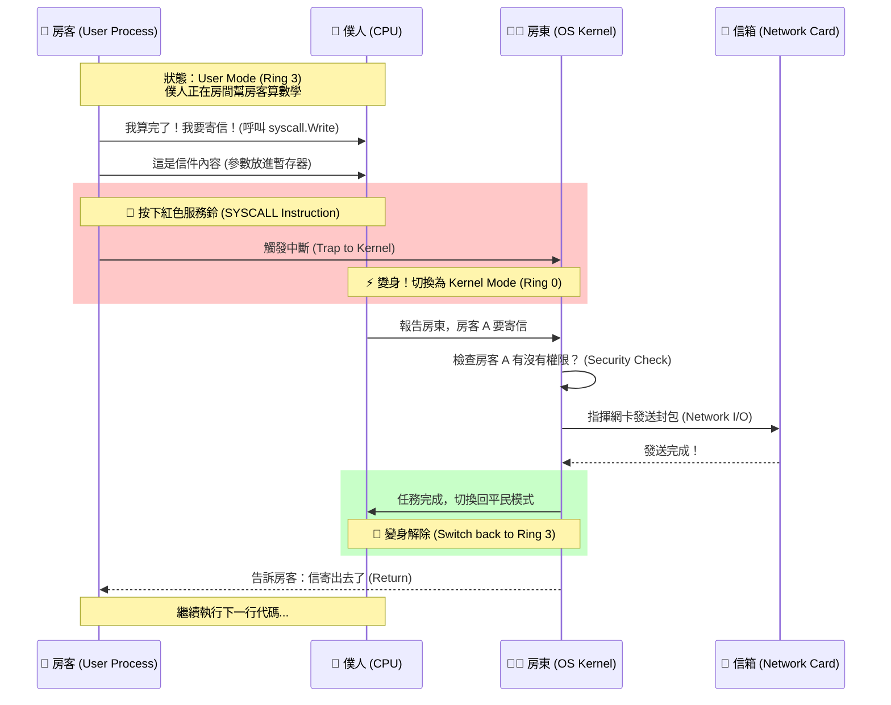

# 作業系統的豪宅隱喻 (The OS Mansion Metaphor)

這是一份關於作業系統 (OS)、程式 (Process) 與硬體 (Hardware) 運作原理的圖解筆記。透過「豪宅」的比喻，讓我們重新理解電腦底層發生了什麼事。

---

## 🏰 豪宅角色介紹 (Cast)

| 豪宅角色 | 電腦科學術語 (CS Term) | 職責與特徵 |
| :--- | :--- | :--- |
| **大豪宅** | **Computer Hardware** | 擁有無限水電、各種設施的物理實體。 |
| **房東兼總管** | **OS Kernel (核心)** | 擁有所有鑰匙 (Ring 0 權限)，決定誰能住進來，管理所有資源。 |
| **SOP 說明書** | **Binary Executable (.exe)** | 靜靜躺在倉庫裡的紙本，寫滿了操作步驟，還沒被執行。 |
| **被叫醒的房客** | **Process (行程)** | 當 SOP 被拿出來執行，OS 分配了一個房間給它，它就變成了活生生的房客。 |
| **VIP 包廂** | **Virtual Memory (虛擬記憶體)** | 房客以為自己住在 1 號大套房，其實是房東變的魔術，對應到真實的物理角落。 |
| **超音速僕人** | **CPU (Central Processing Unit)** | 豪宅裡唯一的苦力。他速度極快，在各個房間之間瞬移 (Context Switch)。 |
| **紅色服務鈴** | **System Call (系統呼叫)** | 房客不能走出房間，想拿倉庫的東西只能按鈴請求房東幫忙。 |

---

## 🖼 豪宅結構圖 (The Architecture)

```mermaid
graph TD
    subgraph Hardware [🏰 硬體豪宅 (Hardware)]
        CPU[🏃 超音速僕人 (CPU)]
        RAM[🪑 真實工作桌 (Physical RAM)]
        Disk[📦 倉庫 (Hard Disk)]
        NIC[mailbox 信箱 (Network Card)]
        
        subgraph KernelSpace [👑 房東總管室 (Kernel Space - Ring 0)]
            OS[👨‍✈️ OS 房東 (Kernel)]
            Driver[🔧 維修工具組 (Drivers)]
        end
        
        subgraph UserSpace [🏠 房客包廂區 (User Space - Ring 3)]
            P1[👤 房客 A (Golang Process)]
            P2[👤 房客 B (Python Process)]
            P3[👤 房客 C (Chrome Process)]
        end
    end

    %% 關係連線
    OS -- "分配房間 (Virtual Memory)" --> P1
    OS -- "分配房間 (Virtual Memory)" --> P2
    
    P1 -- "按服務鈴 (Syscall)" --> OS
    P2 -- "按服務鈴 (Syscall)" --> OS
    
    OS -- "指揮" --> CPU
    OS -- "存取" --> Disk
    OS -- "收發" --> NIC
    
    CPU -.-> P1
    CPU -.-> P2
    note[CPU 在房客之間極速瞬移 <br> 造成'同時服務'的錯覺] -.-> CPU

    style OS fill:#f9f,stroke:#333,stroke-width:4px
    style CPU fill:#ff9,stroke:#f66,stroke-width:2px,stroke-dasharray: 5 5
    style P1 fill:#bbf,stroke:#333
    style P2 fill:#bbf,stroke:#333
```

---

## 🎬 動作流程：按服務鈴 (The Syscall Workflow)

當房客 (Golang Process) 想要把寫好的信寄出去 (Network Write) 時，會發生什麼事？



---

## 🧠 核心觀念總結

1.  **虛擬的假象**：
    Process 以為自己擁有 CPU（僕人一直在）和所有記憶體（大房間），但其實都是 OS 因為 **Time Sharing (時間分片)** 和 **Virtual Memory** 技術所製造的幻覺。

2.  **階級的森嚴**：
    **Ring 0 (房東)** 與 **Ring 3 (房客)** 的界線是絕對的。硬體電路保證了房客絕對無法直接觸碰倉庫（硬碟）或信箱（網卡），必須透過 **System Call** 委託房東執行。

3.  **Go vs Python 的差異**：
    *   **Go**：自帶電話簿，要按服務鈴時，直接拿起紅電話（內建 Assembly）就打給房東。速度快。
    *   **Python**：要按服務鈴時，要先打給櫃檯（C Library），請櫃檯幫忙轉接給房東。手續多一層。

---

## 📝 文檔撰寫風格指南 (Documentation Style Guide)

為了保持系列文檔的一致性與史詩感，請遵循以下章節命名規則：

1.  **章節標題 (Headings)**:
    *   使用 **「樂章 (Movement)」** 來代替普通的「階段 (Phase)」或「步驟 (Step)」。
    *   格式：`## X. 第X樂章：[中文標題] ([English Title])`
    *   範例：
        *   `## 1. 第一樂章：起源 (The Origin)`
        *   `## 2. 第二樂章：創世 (Genesis)`

2.  **隱喻一致性**:
    *   **M (Machine)** -> 館長 / 機甲 (執行者)。
    *   **P (Processor)** -> 待辦清單區域 (List Area) / 任務架。
    *   **G (Goroutine)** -> 任務單 / 章節。
    *   **g0 (System Stack)** -> 主閱讀桌 / 控制台。
    *   **Heap** -> 大黑板 / 公共區。
